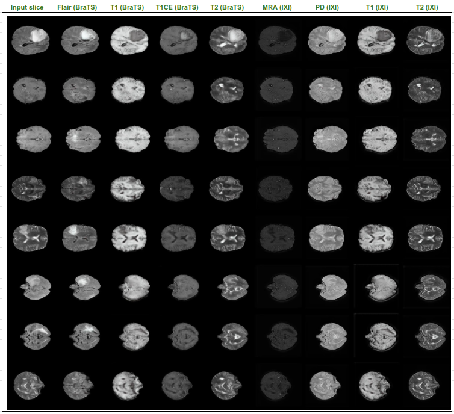

## MRI Synthesis Using Deep Learning Models

<p align="center"></p>

This repository provides the official PyTorch implementation of the following paper: [A Deep Learning Model for Multi-Domain MRI Synthesis Using Generative Adversarial Networks](https://doi.org/10.15388/24-INFOR556)
## Dependencies
* [Python 3.5+](https://www.continuum.io/downloads)
* [PyTorch 0.4.0+](http://pytorch.org/)
* [TensorFlow 1.3+](https://www.tensorflow.org/) (optional for tensorboard)

## Installaiton
```bash
python -m venv venv
. venv/bin/activate
pip install -r requirements.txt
```

## Training networks

To train model on both BraTS2020 and IXI:

```bash
# Train Customed ResUnet using both BraTS2020 and IXI datasets
python main.py --mode=train --dataset Both --image_size 256 --c_dim 4 --c2_dim 4 \
               --sample_dir resunet_custom_new_loss_both/samples --log_dir resunet_custom_new_loss_both/logs \
               --model_save_dir resunet_custom_new_loss_both/models --result_dir resunet_custom_new_loss_both/results \
               --batch_size 4

# Test Customed ResUnet using both BraTS2020 and IXI datasets
python main.py --mode test --dataset Both --image_size 256 --c_dim 4 --c2_dim 4 \
               --sample_dir resunet_custom_new_loss_both/samples --log_dir resunet_custom_new_loss_both/logs \
               --model_save_dir resunet_custom_new_loss_both/models --result_dir resunet_custom_new_loss_both/results \
               --batch_size 4
```

## Citation
If you find this work useful for your research, please cite [paper]([https://arxiv.org/abs/1711.09020](https://doi.org/10.15388/24-INFOR556)):
```
@article{han2024,
  author = {Le Hoang Ngoc Han and Ngo Le Huy Hien and Luu Van Huy and Nguyen Van Hieu},
  title = {A Deep Learning Model for Multi-Domain MRI Synthesis Using Generative Adversarial Networks},
  journal = {Informatica},
  volume = {35},
  number = {2},
  pages = {283-309},
  year = {2024},
  doi = {10.15388/24-INFOR556}
}
```
